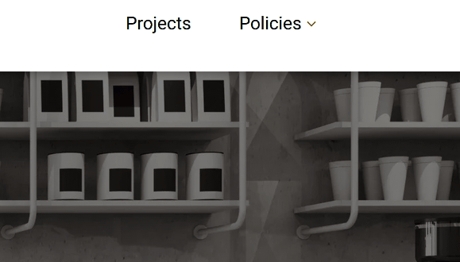

# tmdip.co.uk


## Project

**This project is now archived because the website is no longer active since the business decided to close.**

A fully responsive static website for TMD Interior Projects & Building Services.

### Tech
- Nuxt 2
- Prismic
- TypeScript
- dotenv
- SCSS
- GitHub Pages

### Screenshots
#### Desktop


#### Tablet


#### Mobile


#### Navigation

Desktop navigation



The desktop navigtion was also built so that is could be usable by touch-screen devices (as demonstrated below).


Mobile & tablet navigation


## Development

### Setup

- `git clone https://github.com/jackdomleo7/tmdip.co.uk`
- `cd tmdip.co.uk`
- `npm i`
- Create a `.env` file in the root with the following variables (these are not committed to git):
  - `PRISMIC_ENDPOINT`
  - `PRISMIC_ACCESS_TOKEN`

### Scripts

```bash
# install dependencies
$ npm install

# serve with hot reload at localhost:3000
$ npm run dev

# build for production and launch server
$ npm run build
$ npm run start

# generate static project
$ npm run generate

# run `npm run generate` and push contents of dist directory to a remote gh-pages branch (only works in the master branch)
$ npm run deploy
```

For detailed explanation on how things work, check out [Nuxt.js docs](https://nuxtjs.org).
